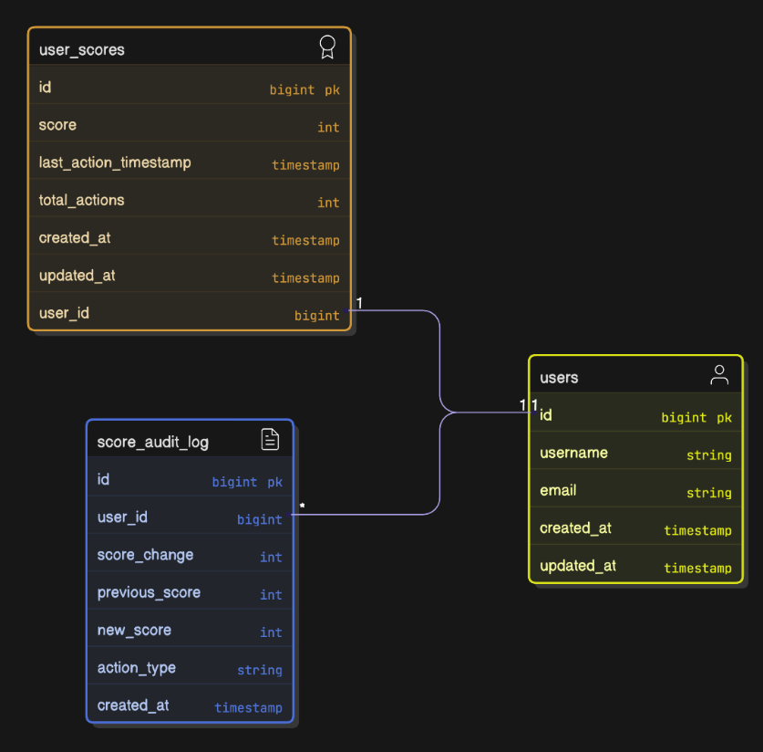
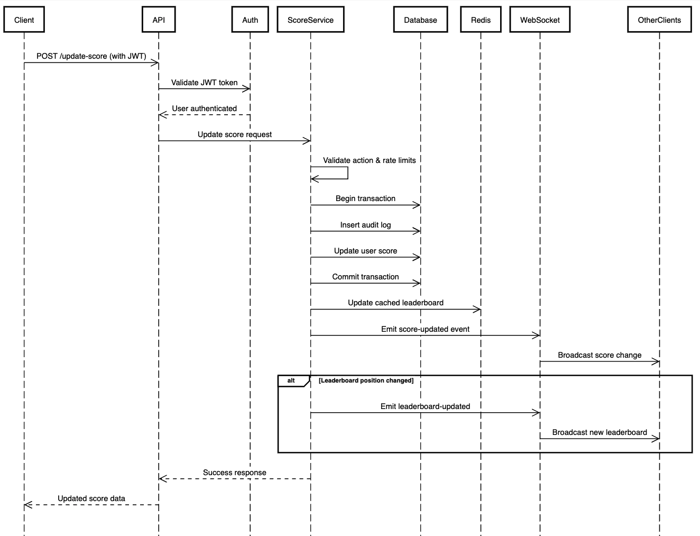

# Score Board API Module

A real-time score tracking system with live updates and anti-cheat protection.

## Overview

This module provides a secure, real-time score board system that tracks user scores, prevents unauthorized score manipulation, and delivers live updates to connected clients. The system is designed to handle high-frequency score updates while maintaining data integrity and security.

## Architecture

### Components

- **Score Controller** - REST API endpoints for score operations
- **Score Service** - Business logic and score validation
- **Score Repository** - Data persistence layer
- **Score Gateway** - WebSocket gateway for real-time updates
- **Authentication Middleware** - Request validation and user verification

### Technology Stack

- **Framework**: NestJS (TypeScript)
- **Database**: MySQL with TypeORM
- **Real-time**: WebSocket (Socket.IO)
- **Authentication**: JWT Bearer tokens
- **Caching**: Redis

## Database Design



## API Endpoints

### GET /score-board/leaderboard
Get the top users by score with limit.

**Params:**
```
limit: number of top users records, default 10.
```
**Response:**
```typescript
{
  data: Array<{
    userId: string;
    username: string;
    score: number;
    rank: number;
    lastUpdated: string;
  }>;
  limit: number;
}
```

### POST /score-board/update-score
Update user's score after completing an action.

**Headers:**
```
Authorization: Bearer <jwt_token>
Content-Type: application/json
```

**Request Body:**
```typescript
{
  actionType: string;        // Type of action completed
  clientTimestamp: string;   // ISO timestamp from client
}
```

**Response:**
```typescript
{
  userId: string;
  newScore: number;
  scoreIncrease: number;
  currentRank: number;
  previousRank?: number;
}
```

### GET /score-board/user/:userId/score
Get specific user's score and rank.

**Response:**
```typescript
{
  userId: string;
  score: number;
  rank: number;
  totalActions: number;
  lastActionTimestamp: string;
}
```

### WebSocket Events

#### Client → Server
- `join-scoreboard` - Subscribe to real-time updates
- `leave-scoreboard` - Unsubscribe from updates

#### Server → Client
- `score-updated` - Broadcast when any user's score changes
- `leaderboard-updated` - Broadcast when top 10 changes

```typescript
// score-updated event payload
{
  userId: string;
  newScore: number;
  scoreIncrease: number;
  username: string;
  timestamp: string;
}

// leaderboard-updated event payload
{
  leaderboard: Array<{
    userId: string;
    username: string;
    score: number;
    rank: number;
  }>;
  timestamp: string;
}
```

## Execution Flow



## Error Handling

### Common Error Responses

```typescript
// Unauthorized access
{
  error: "UNAUTHORIZED",
  message: "Valid authentication token required"
}

// Invalid action
{
  error: "INVALID_ACTION",
  message: "Action type not recognized or not allowed"
}

```

## Implementation Guidelines

### 1. File Structure
```
src/
├── controllers/
│   └── scoreboard.controller.ts
│   └── ...
├── services/
│   ├── scoreboard.service.ts
│   └── score-validation.service.ts
│   └── ...
├── gateways/
│   └── scoreboard.gateway.ts
│   └── ...
├── entities/
│   ├── user.entity.ts
│   ├── user-score.entity.ts
│   └── score-audit-log.entity.ts
│   └── ...
├── dto/
│   ├── update-score.dto.ts
│   └── leaderboard.dto.ts
│   └── ...
├── guards/
│   └── ...
├── modules/
│   └── scoreboard.module.ts
│   └── ...
```

### 2. Service Dependencies
- Extend existing user management system
- Integrate with current authentication middleware
- Use established database connection patterns
- Follow existing API response formats

### 3. Testing Requirements
- Unit tests for score calculation logic
- Integration tests for API endpoints
- Load testing for concurrent score updates

## Performance Considerations

### 1. Caching Strategy
- Redis cache for top 10 leaderboard
- 5-minute cache timeout with immediate invalidation on changes
- User score caching for frequent rank queries

### 2. Database Optimization
- Composite indexes on score and timestamp fields
- Database transactions for atomic operations

### 3. Real-time Updates
- WebSocket connection pooling
- Event debouncing for rapid score changes
- Selective broadcasting based on leaderboard impact

## Future Improvements

- Add rate-limiting guard for anti-abuse protection.
- Multi-region deployment support
- Microservice decomposition for better scaling